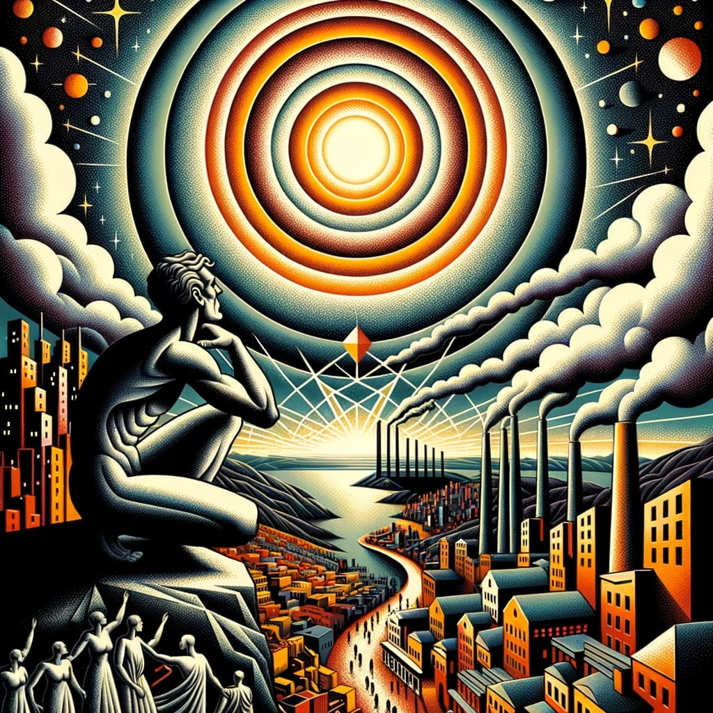

# A Eletricidade Reflectida: um diálogo entre Álvaro de Campos, e a sua busca por serenidade e poesia

_"Sob o manto do céu nocturno, onde as estrelas cintilam como lâmpadas numa vasta rede eléctrica, Álvaro de Campos, o engenheiro futurista, solta um suspiro"_

**Álvaro de Campos:**
```poem
"Ah, a electricidade! A centelha da modernidade, a luz que banha as cidades mas que também consome a natureza. 
Porque avança a técnica, mas o coração humano teima em permanecer ancorado no seu próprio interesse?"
```
_"Ricardo Reis, o doutor sereno, com ponderação, intervém"_

**Ricardo Reis:**
```poem
"Álvaro, a electricidade em si não é virtuosa nem vilã. É o propósito humano que a define. 
Devemos almejar uma energia que esteja em sintonia com a natureza, que respeite o equilíbrio do mundo. 
Uma electricidade que não se submeta ao lucro, mas que sirva a comunidade."
```
_"Alberto Caeiro, o poeta dos prados, olhando o horizonte, murmura"_

**Alberto Caeiro:**
```poem
"Quando observo os rios e os montes, entendo: a genuína electricidade está no palpitar da terra, no sibilar do vento, na cadência das águas. 
Devemos inspirar-nos na natureza, e não pretender dominá-la. A electricidade mais equitativa é a que se funde em harmonia com o universo."
```
_"Álvaro de Campos, tocado pelas palavras dos seus heterónimos, exclama"_

**Álvaro de Campos:**
```poem
"Então, almejemos uma nova aurora! Um tempo onde a electricidade não seja meramente um instrumento,mas uma extensão da essência terrena.
Uma electricidade ponderada, que ilumine não só as nossas moradas, mas também as nossas almas."
```
_"E deste modo, entre reflexões e diálogos, começa a esboçar-se a ideia de uma electricidade mais equitativa, inspirada pela lucidez de três das mais notáveis mentes da literatura portuguesa."_


