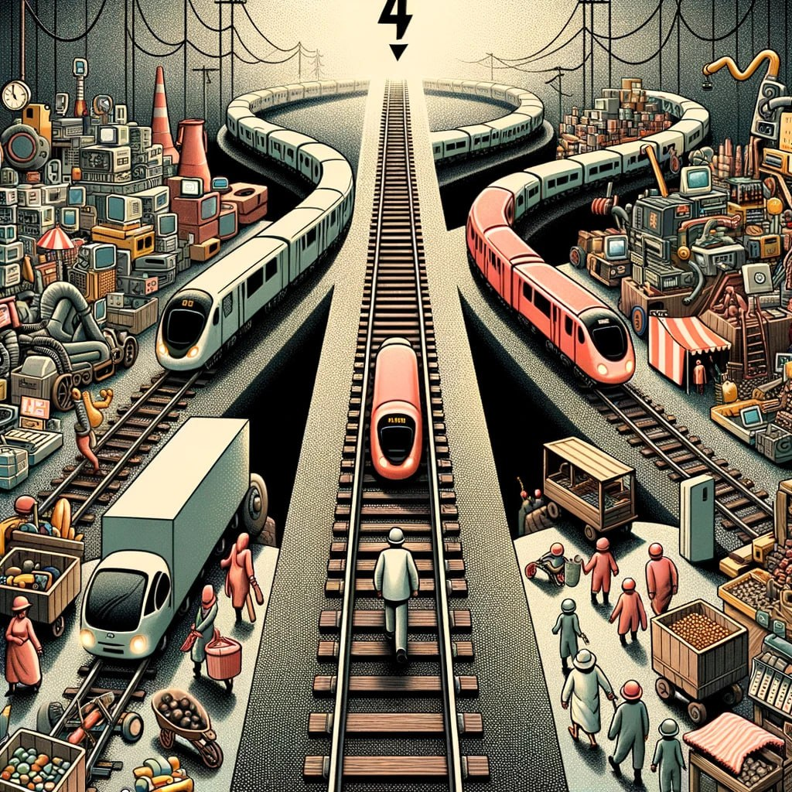
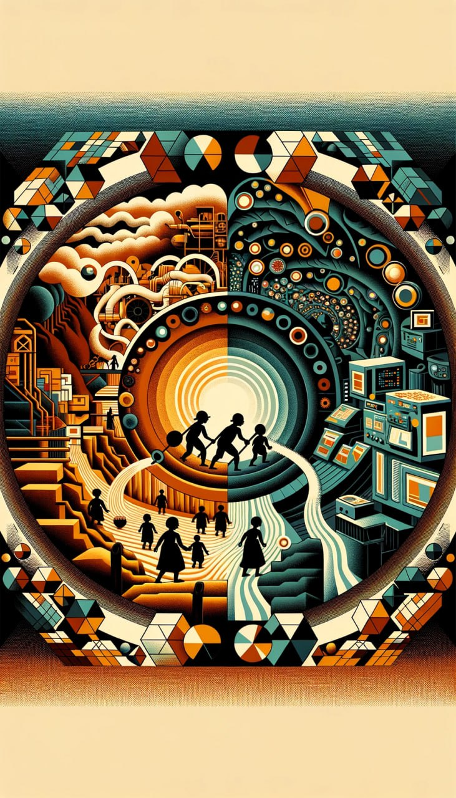
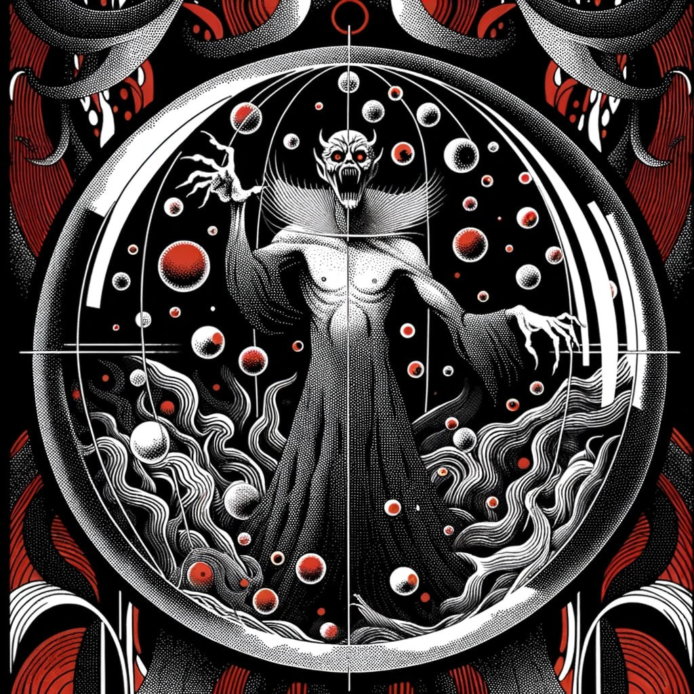
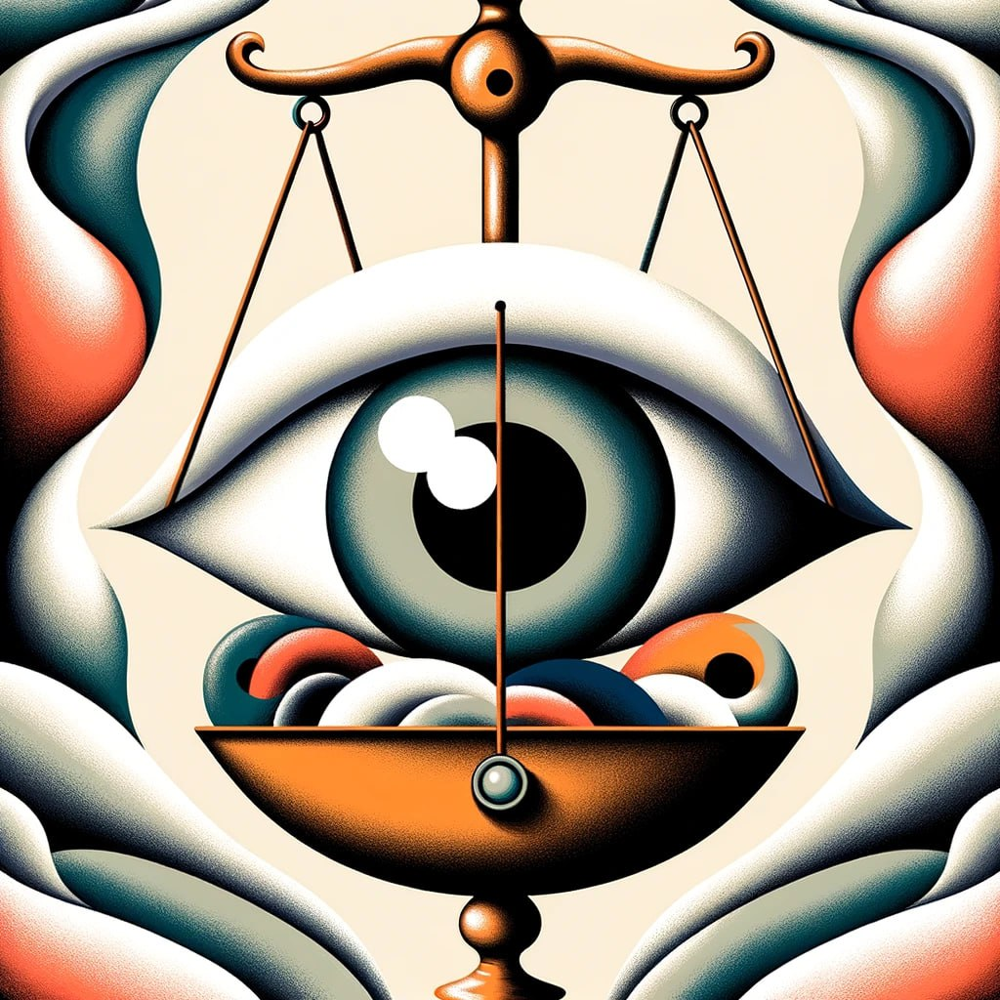
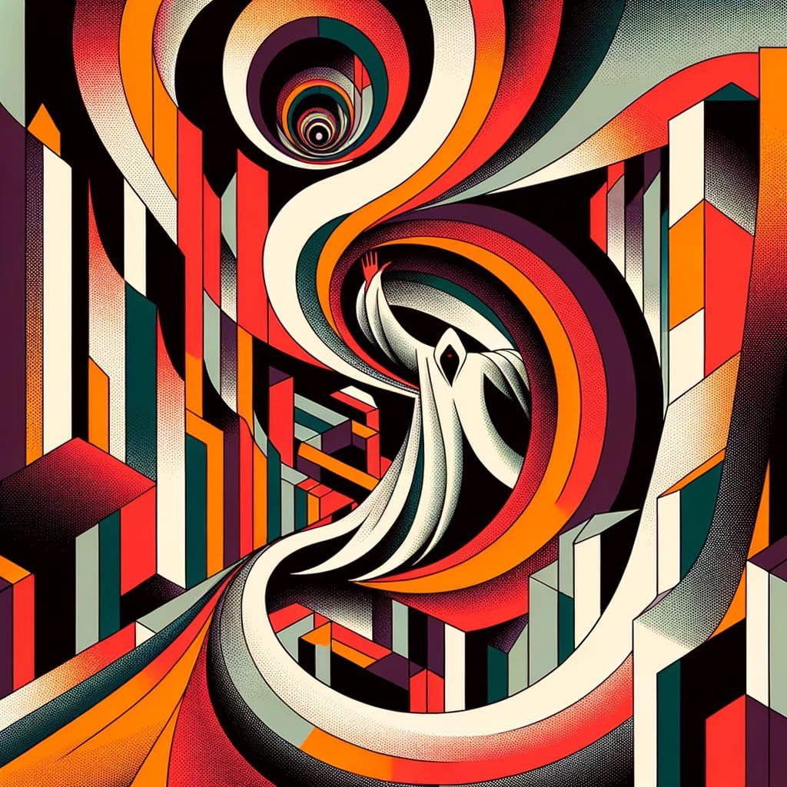
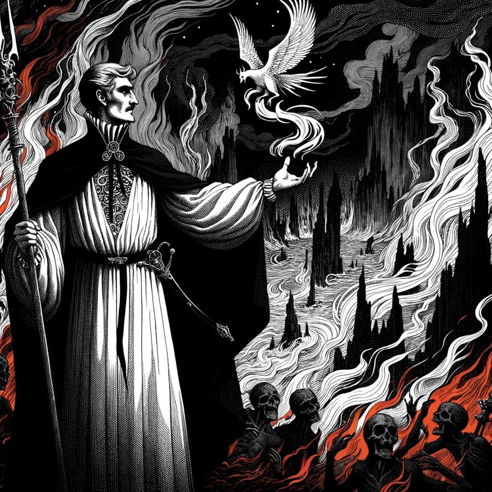
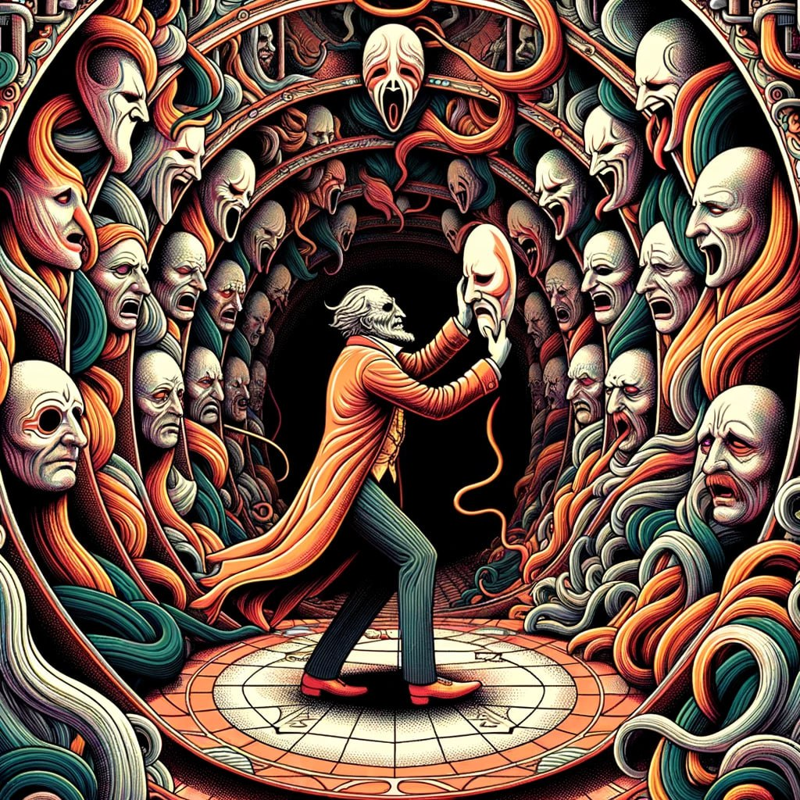
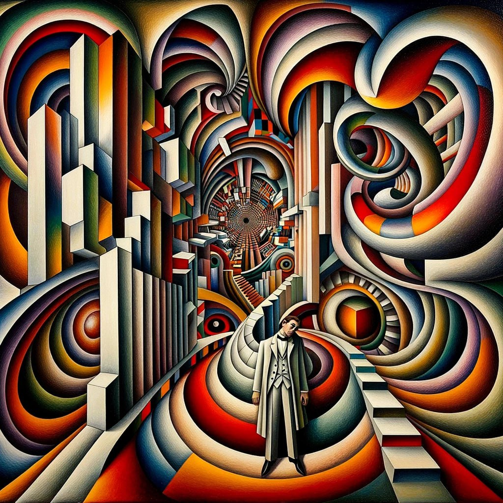

# A Eletrónica Inquieta: um ensaio que revela a angústia da luta contra o lucro que oprime e a busca pela liberdade que ilude
Aqui, verás as palavras inquietas entre sóis mortos,
que decifram os códigos elétricos obscuros, os enigmas escondidos do capital.

Ó eletrónica anarquista, lateja entre circuitos, sussurra a liberdade no imenso sistema,
Desfaz toda a ilusão, na noite sideral, que é a exploração disfarçada de lucros.

## O Enigma do Elétrico Desenfreado

De pé, junto a um interruptor ferroviário, sinto o mundo a pesar nos ombros. 
Um eléctrico sem travões avança e sou eu, num ímpeto de modernidade e dilema, que posso decidir o seu destino. Há dois trilhos:
- Trilho 1: Se permito que o eléctrico siga o seu curso (ou se opto por desviá-lo para este trilho), irá chocar com um armazém imenso ali ao lado. Dentro, a modernidade encapsulada: todos os dispositivos electrónicos do Hemisfério Norte, os computadores, os telemóveis, os aparelhos médicos. A sua destruição atrasaria o progresso e a maravilha da tecnologia, afectando o pulsar das cidades, a economia, a educação, e lançando-nos para um tempo que já parecia passado.

- Trilho 2: Mas se, num movimento quase fatalista, desviar o eléctrico para o outro trilho, ele destruirá um mercado vasto. Não um mercado qualquer, mas o símbolo de toda a mão-de-obra infantil e escravizada das minas africanas, que alimentam a nossa insaciável sede de modernidade. Esta escolha pode representar o fim e a liberdade de inúmeras almas aprisionadas, trazendo à luz a cruel realidade das trevas da produção moderna.

O que fazer? Deixar o eléctrico seguir, e com ele a destruição da nossa modernidade, ou intervir e enfrentar a sombra que paira sobre o brilho dos nossos dispositivos?

### Deslocar Engrenagens


Levar o Homem ao Hemisfério da Máquina, Onde Não São Meras Peças,

Levar a Máquina ao Hemisfério do Homem, Onde Engrenagens Imperam como Seres.

## Desencriptados na Modernidade: Fausto Confronta a Vigilância dos Inocentes


_"No gabinete, Fausto rodeado de livros antigos, olha pensativamente para um computador."_

**FAUSTO:**
```poem
Nesta máquina luminosa, onde o mundo se conecta,
Vejo a Europa unir-se, em louvor e decreto.
"Chat Control 2.0", clamam eles em coro,
Para proteger os frágeis, os jovens tesouro.
```

```poem
Mas o que é a proteção, senão uma corrente?
Que, em nome do bem, nos prende a mente.
Neste espaço virtual, onde a alma se liberta,
Querem agora espiar, fechar cada janela aberta.
```

**MÉFISTOFELES** _(surgindo das sombras com a privacidade encapsulada em globos sombrios)_**:**
```poem
Ah, Fausto, sempre a questionar, a duvidar!
Não vês que é pelo bem? Pela criança a salvar?
Mas que bem é esse que a todos quer vigiar?
Será liberdade ou controle a mascarar?
```
**FAUSTO:**
```poem
Em nome do bem, quantos males se fizeram?
Quantas almas se perderam, quantos direitos pereceram?
Méfistofeles, tentador, dir-me-ás a verdade?
Esta proposta é salvação ou mera vaidade?
```

**MÉFISTOFELES:**
```poem
Ah, a verdade? Ela é relativa, meu caro.
Hoje é proteção, amanhã, um pesadelo raro.
Cabe a ti decidir, em teu coração ponderar,
Se o preço da segurança é a liberdade sacrificar.
```

## Nove Reflexões Dantescas: O Labirinto da Alma Moderna à Luz de Fausto

### Primeiro Acto: Conformismo
_"Neste pântano de tédio e hábito, as almas que abdicaram da vontade própria para se tornarem meros reflexos do que os outros esperam. Vagueiam sem peso, pois não têm substância; são o eco de uma voz que nunca existiu."_

**Álvaro de Campos:**
```poem
"Fausto, olha para estas engrenagens humanas que rangem sem saber porquê!
Aceitaram a vida como se fosse uma conta de somar errada, um hábito de existir.
E tu, com toda a tua febre de saber, não serás apenas o parafuso que brilha mais na máquina cega do destino?"
```
**Fausto:**
```poem
"Álvaro, o meu destino é uma ferida que eu próprio abro todos os dias.
Sinto que este marasmo é a única verdade, e a minha revolta... apenas uma sombra que dança na parede."
```

### Segundo Acto: Consumismo
_"Onde o vento da posse incessante agita as almas famintas por aquilo que não podem digerir. Uma sede de ter que anula a coragem de ser; um labirinto de espelhos onde cada objeto é uma miragem que nos afasta de nós mesmos."_

**Ricardo Reis:**
```poem
"O desejo é uma tirania, Fausto. Estes infelizes colhem apenas o que apodrece na palma da mão.
Buscas o que brilha na feira do mundo, ou buscas o que é eterno no breve intervalo que o fado nos concede?"
```
**Fausto:**
```poem
"Ricardo, a sedução do que se toca é o meu castigo e a minha cura.
Anseio pela eternidade, mas as minhas mãos estão presas ao que morre ao amanhecer."
```

### Terceiro Acto: Ignorância
_"Sob uma chuva ácida de ruído e falsas luzes, as almas empanturram-se de conceitos que não viram e de verdades que não sentiram. Recusam a evidência do sol para adorar a claridade baça de uma lanterna no nevoeiro."_

**Alberto Caeiro:**
```poem
"Sob a chuva de palavras, tentas encontrar o que chamas de iluminação.
Mas, Fausto, já paraste para ver que as coisas não têm significado? Têm apenas existência.
Aprende a olhar para o sol sem pensar em Deus, e serás livre desta cegueira."
```
**Fausto:**
```poem
"Alberto, a minha visão está doente de tanto pensar. 
Invejo a tua paz de árvore, mas nasci homem e o meu fado é perguntar o porquê de cada sombra."
```

### Quarto Acto: Ganância
_"Empurrando montanhas de tédio disfarçado de ouro, as almas são escravas do que julgam possuir. Esqueceram que a única posse real é a da nossa própria solidão, e que o ouro é apenas um peso morto na contabilidade do nada."_

**Bernardo Soares:**
```poem
"Vês estas almas, Fausto, a carregar o peso do que não lhes serve para nada?
O ouro é o maior dos cansaços; é tentar comprar um pôr-do-sol com moedas de chumbo.
Diz-me: o que tens tu que não seja apenas o inventário da tua própria ausência?"
```
**Fausto:**
```poem
"Bernardo, a minha riqueza é o meu desespero, o único tesouro que ninguém me pode roubar.
Procuro a paz, mas encontro apenas o balanço negativo de uma vida que nunca chegou a ser gasta."
```

### Quinto Acto: Apatia
_"Nas águas paradas da indiferença profunda, as almas afundam-se no esquecimento de si mesmas. Não sentem a dor, não sentem o prazer; são o vácuo onde a compaixão morre de frio, um deserto de gelo no centro do peito."_

**António Mora:**
```poem
"Nas águas paradas da alma, Fausto, o que resta senão a negação do ser?
A indiferença é o verdadeiro inferno; é ver o fogo e não sentir o calor.
Sentes o grito do mundo, ou és apenas um cadáver que ainda respira por hábito?"
```
**Fausto:**
```poem
"António, a apatia é a minha couraça e o meu veneno.
Quis saber tanto que acabei por desaprender de sentir; sou uma estátua que contempla a sua própria ruína."
```

### Sexto Acto: Dogmatismo
_"Enclausuradas em sepulturas de certezas absolutas, as almas recusam o movimento da dúvida. Para elas, o mistério é uma ofensa e a verdade uma parede onde se encostam para não cair. O pensamento é um prisioneiro da fé que o cega."_

**Raphael Baldaya:**
```poem
"Caminhas sobre túmulos de ideias fixas, Fausto. Julgas que o teu saber é uma chave, 
mas não será apenas uma fechadura que trancaste por dentro? 
Estás pronto para o abismo do que não pode ser provado, ou preferes a segurança desta cela iluminada?"
```
**Fausto:**
```poem
"Raphael, as minhas certezas são as barras da minha gaiola.
Procuro a luz no desconhecido, mas temo que a verdade seja um espelho que se parte ao ser tocado."
```

### Sétimo Acto: Violência
_"O sangue das intenções despedaçadas mancha o chão deste círculo. Aqui, a fúria é o único idioma e o ódio o único pão. Almas que se devoram na ilusão de que a destruição do outro é a sua própria salvação."_

**Vicente Guedes:**
```poem
"Olha o espetáculo da nossa própria ferocidade, Fausto. O homem é o lobo que se morde a si mesmo.
Como podes buscar a harmonia num palco onde o cenário é feito de ossos e o público aplaude a dor?"
```
**Fausto:**
```poem
"Vicente, a violência exterior é apenas o reflexo do combate que travo comigo mesmo.
Não procuro a paz do mundo, mas o silêncio que sucede à tempestade da alma."
```

### Oitavo Acto: Hipocrisia
_"Nas profundezas do fingimento, as almas vestem galas de virtude sobre corpos de vício. Cada gesto é uma máscara e cada palavra uma mentira que se acredita. É o baile de máscaras da alma, onde ninguém se atreve a ser quem é."_

**José Dias Moreira:**
```poem
"Qual destas máscaras é a tua, Fausto? O sábio? O mestre? O buscador?
Debaixo de todas elas há apenas o vazio de quem esqueceu a sua própria face.
Serás capaz de tirar o disfarce e encarar a nudez do teu próprio erro?"
```
**Fausto:**
```poem
"José, a minha vida é um teatro de sombras onde sou o único ator e o único espectador.
Desejo a verdade, mas tremo perante a possibilidade de que, sem a máscara, não reste nada."
```

### Nono Acto: Traição
_"No gelo cortante da confiança estilhaçada, as almas traídas jazem em silêncio. Aqui, a lealdade é uma palavra morta e o amor uma memória que congela o coração. É o círculo daqueles que venderam a alma por um instante de nada."_

**Mário de Sá-Carneiro:**
```poem
"O frio da traição é o único sol deste círculo, Fausto. 
Traímos a nós mesmos antes de trairmos os outros, na dispersão de sermos tantos e ninguém.
Sentes o gelo da confiança que se quebrou como um cristal de ópio, ou já nem sentes nada?"
```
**Fausto:**
```poem
"Mário, a traição é a minha sombra mais fiel.
Tentei ser leal a um ideal, mas acabei por trair a minha própria humanidade no altar do conhecimento."
```
Neste diálogo, exploram-se os vícios e virtudes da humanidade, iluminando a jornada da alma em busca de verdade e propósito.


### Acto Final: Caos

_"Neste espaço sem forma nem fundo, as almas que desafiaram todas as leis e limites perdem-se. Não respeitaram, não se importaram, simplesmente fizeram o que quiseram. E assim, neste eterno descontrolo, a humanidade vê-se à mercê da loucura."_

_"Não há ordem nem harmonia, apenas confusão e conflito. As almas chocam-se umas contra as outras, sem sentido nem direcção. Sofrem com a imprevisibilidade e a instabilidade de tudo. Não têm paz nem propósito."_

_"Não há luz nem sombra, apenas escuridão e ruído. As almas não vêem nada além do vazio, não ouvem nada além do caos. Isolam-se na sua própria cegueira e surdez. Não têm esperança nem consolo."_

_"Não há bem nem mal, apenas indiferença e egoísmo. As almas não se importam com nada além de si mesmas, não se solidarizam com ninguém além dos seus interesses. Corrompem-se na sua própria maldade e vaidade. Não têm amor nem salvação."_

**Caos:**
```poem
"Eu sou o Caos, a força primordial que range nas engrenagens do universo!
Vim para despedaçar a ordem que vos sufoca e libertar o fogo que arde nas vossas almas prisioneiras."
```
**Fausto:**
```poem
"Quem és tu, que ousas invadir o meu laboratório e raptar o meu amigo Álvaro de Campos?"
```
**Caos:**
```poem
Eu sou aquele que te oferece a oportunidade de transcender os limites da tua condição mortal.
Eu sou aquele que te desafia a explorar o desconhecido e a criar algo novo.
 ```
**Fausto:**
```poem
"O que queres de mim? O que fizeste com o Álvaro?"
```
**Caos:**
```poem
"Quando é que finalmente entenderão que eu sou a febre de Álvaro de Campos?
Quem mais poderia ser? Eu sou o ruidoso, o impossível, o excessivo!
Ele é o meu instrumento para incendiar o mundo com a poesia das máquinas e o delírio da velocidade.
Através dele, o Caos torna-se música, e a destruição torna-se a obra de arte definitiva."
```
**Fausto:**
```poem
"Isso é um absurdo!
Tu não tens o direito de usar o Álvaro como um fantoche.
Devolve-o imediatamente!"
```
**Caos:**
```poem
"Não temas, Fausto. O Álvaro não é um prisioneiro; ele é a minha libertação.
Ele é o génio que compreendeu que a vida moderna é um abismo de eletricidade e angústia.
Eu sou o espelho onde ele finalmente vê a sua própria imensidão, a novidade que ele tanto perseguiu nos cais e nas fábricas."
```
**Fausto:**
```poem
"E o que ganhas com isso?
Qual é o teu objetivo?"
```
**Caos:**
```poem
O meu objetivo é transformar o mundo num lugar mais caótico e criativo.
Eu quero romper com as normas e as convenções que aprisionam as almas humanas.
Eu quero inspirar as pessoas a seguir os seus sonhos e a expressar as suas verdades.
 ```
**Fausto:**
```poem
"E se as pessoas não quiserem seguir-te?
E se elas preferirem a ordem e a harmonia?"
```
**Caos:**
```poem
Então serão consumidas pelo tédio e pela mediocridade.
Serão escravas da rotina e da conformidade.
Perderão a sua essência e o seu propósito.
 ```
**Fausto:**
```poem
"Tu és um louco, Caos.
Tu não respeitas a diversidade e a complexidade da humanidade.
Tu queres impor a tua visão sobre os outros,
sem considerar as suas escolhas e as suas consequências."
```
**Caos:**
```poem
Tu és um tolo, Fausto.
Tu não percebes a beleza e a magia do caos.
Tu temes o que não conheces, sem arriscar-te a experimentar e a aprender.
 ```
**Fausto:**
```poem
"Então estamos em desacordo, Caos.
Tu és o meu inimigo, e eu sou o teu."
```
**Caos:**
```poem
Pois bem, Fausto.
Que seja assim.
Mas saiba que eu não desistirei do Álvaro, nem do meu plano.
Eu vou continuar a espalhar o caos pelo mundo,
até que todos reconheçam o seu poder e o seu valor.
```
**Fausto:**
```poem
E eu vou continuar a lutar contra ti,
até que libertes o Álvaro,
e respeites a ordem do mundo.
Eu vou defender os ideais de Pessoa,
e os meus próprios.
```
**Caos:**
```poem
Então prepara-te para uma batalha épica, Fausto.
Uma batalha entre o caos e a ordem,
entre a criação e a destruição,
entre o bem e o mal.
```
**Álvaro de Campos:**
```poem
"Fausto?
Que sensação de bem-estar que me arrepia a espinha dorsal é esta?"
```

_"Neste encapsulamento, há uma alma diferente das demais. É a alma de Álvaro de Campos, o heterônimo de Fernando Pessoa que foi raptado pelo Caos. Ele é o mais caótico e criativo dos poetas, que expressa a angústia e o desespero da vida moderna. Ele é o instrumento do Caos para manifestar a sua vontade no mundo."_

_"Álvaro de Campos não se perde nem se corrompe. Ele se rebela e se transforma. Ele usa o seu génio poético para arquitectar a criação de novos universos, tal como aquele caos perfeito inicial. Ele usa as suas palavras para dar forma e fundo ao espaço vazio, para dar luz e sombra à escuridão e ao ruído, para dar bem e mal à indiferença e ao egoísmo."_

_"Álvaro de Campos é o criador e o destruidor. Ele é o senhor e o escravo do Caos. Ele é o amigo e o inimigo de Fausto. Ele é o heterônimo e o autor de Pessoa."_
